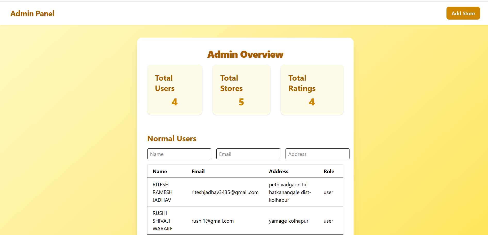
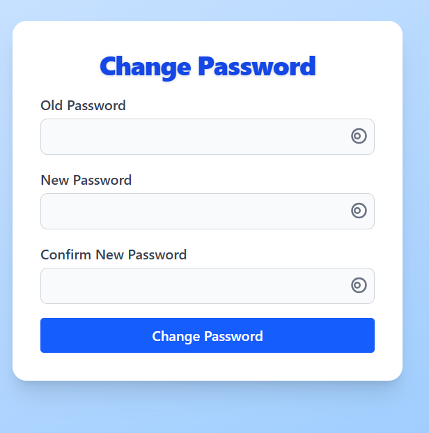
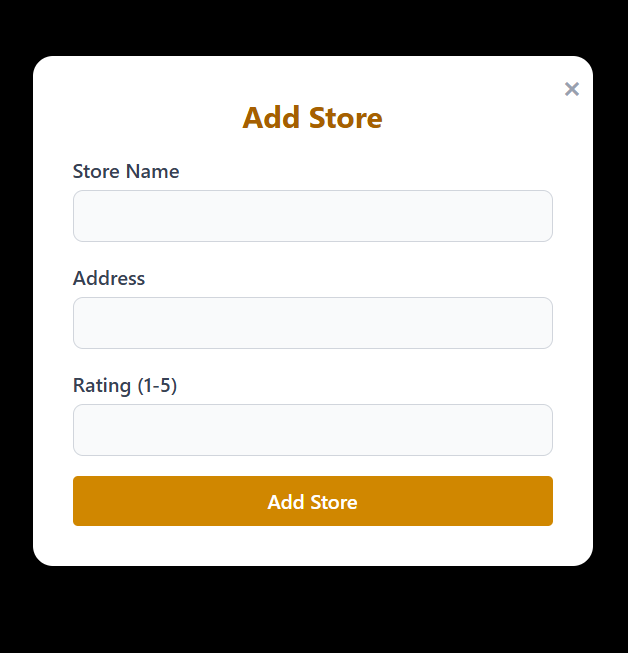
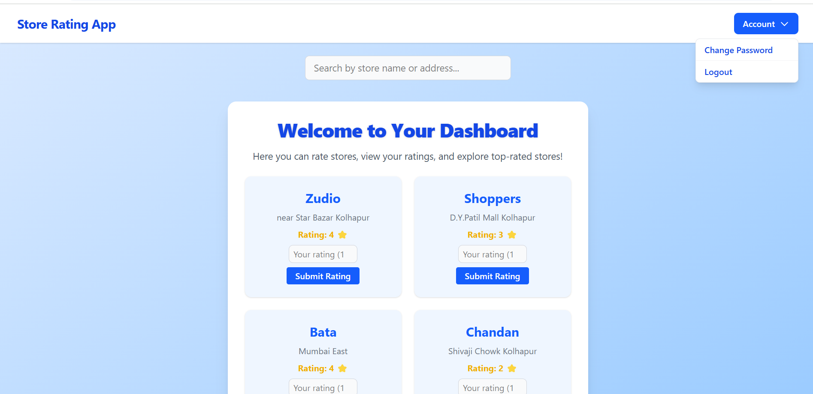
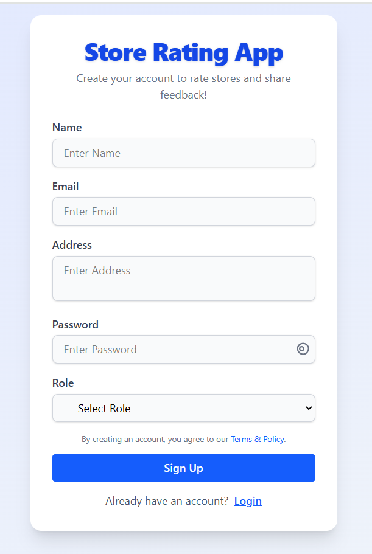

Store Rating App
# Screenshots & Images

Below are some images from the app (located in `src/assets/`):

### Admin Dashboard


### Change Password Page


### Login Page


### Store Page


### User Dashboard


### Signup Page


# React + Vite
# Store Rating App

## Overview
Store Rating App is a full-stack web application for rating stores and managing users, built with React (frontend), Express (backend), and MySQL (database).

## Features
- User registration and login
- Admin dashboard with user, store, and rating analytics
- Change password functionality for users and owner
- Rate stores and view ratings
- Responsive, modern UI


---

## 🔑 Authentication API Endpoints

| Endpoint                | Method | Description                                 |
|-------------------------|--------|---------------------------------------------|
| `/register`             | POST   | Register a new user or store owner          |
| `/login`                | POST   | Login as admin, user, or store owner        |
| `/update-password`      | POST   | Change password for logged-in user/owner    |

---

---
## 🛡️ Security Notes

- Admin login uses hardcoded credentials: `admin@store.com` / `Admin@123`.
- Passwords are stored in the database (recommend hashing in production).
- Passwords must be 8-16 chars, include 1 uppercase and 1 special character.

---

## Project Structure

```
Backend/
  src/
	 index.js        # Express backend API
	 db.js           # MySQL connection
  package.json      # Backend dependencies

---

## ✨ Overview

**Store Rating App** is a modern full-stack web application for rating stores and managing users, built with React, Express, and MySQL. It features beautiful dashboards, secure authentication, and a responsive UI.

---

## 🎯 Features

- 👤 User registration and login
- 🏪 Store owner registration (fixed email: `owner@store.com`)
- 🛡️ Admin dashboard with analytics
- 📊 Store owner dashboard with user ratings and averages
- 🔒 Change password for users and owner
- ⭐ Rate stores and view ratings
- 📱 Responsive, modern UI

---

## 🗂️ Project Structure

```text
Backend/
  src/
	 index.js        # Express backend API
	 db.js           # MySQL connection
  package.json      # Backend dependencies

Frontend/
  Store-Rating-App/
	 src/
		App.jsx       # Main React app
		pages/        # Page components (Login, Signup, Dashboards, etc.)
		assets/       # Images and icons
	 public/
	 package.json    # Frontend dependencies
	 vite.config.js  # Vite config
```

---

## ⚡ Setup Instructions

### Backend
1. Install dependencies:
	```bash
	cd Backend
	npm install
	```
2. Configure MySQL database in `src/db.js` or with environment variables:
	- `DB_HOST`, `DB_USER`, `DB_PASSWORD`, `DB_NAME`
3. Start backend server:
	```bash
	npm run dev
	```

### Frontend
1. Install dependencies:
	```bash
	cd Frontend/Store-Rating-App
	npm install
	```
2. Start frontend server:
	```bash
	npm run dev
	```

---

## 🛠️ Usage

- Register as a user or store owner (owner email: `owner@store.com`)
- Login as admin (`admin@store.com` / `Admin@123`), user, or owner
- Admin dashboard: view counts and lists
- Store owner dashboard: view ratings and users
- Change password from dashboard
- Rate stores and view ratings

---

## 🖼️ Screenshots & Images

Below are some images from the app (located in `src/assets/`):

| Admin Dashboard | Change Password | Login Page |
|---|---|---|
|  |  |  |

| Store Page | User Dashboard | Other Images |
|---|---|---|
|  |  |   |

---

## 🧰 Technologies Used

- React
- Express
- MySQL
- Vite
- Tailwind CSS

---

## 👤 Author

**Ritesh Jadhav**

---

## 📄 License

MIT


